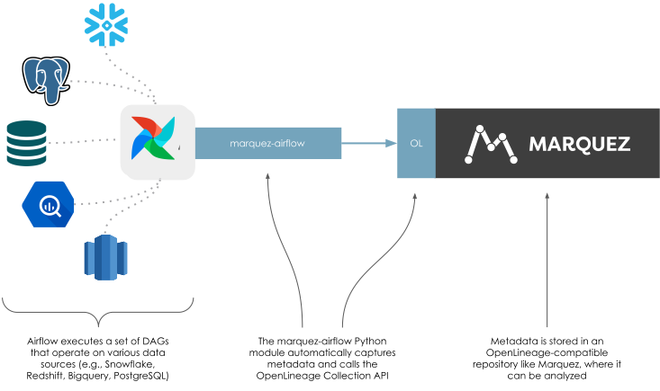

# Apache Airflow

:::caution
This content is **out of date** and may result in a frustrating experience. Please refer to the instructions in the [`integration/airflow` folder of the OpenLineage GitHub repo](https://github.com/OpenLineage/OpenLineage/tree/main/integration/airflow) for the time being.
:::

**Airflow** is a widely-used workflow automation and scheduling platform that can be used to author and manage data pipelines. Airflow uses workflows made of directed acyclic graphs (DAGs) of tasks. To learn more about Airflow, check out the Airflow [documentation](https://airflow.apache.org/docs/apache-airflow/stable/index.html).

## How does Airflow work with OpenLineage?

Understanding complex inter-DAG dependencies and providing up-to-date runtime visibility into DAG execution can be challenging. OpenLineage integrates with Airflow to collect DAG lineage metadata so that inter-DAG dependencies are easily maintained and viewable via a lineage graph, while also keeping a catalog of historical runs of DAGs.




The integration is implemented using the [openlineage-airflow](https://pypi.org/project/openlinage-airflow) integration library, which we'll use to send OpenLineage events to [Marquez](https://marquezproject.ai). The DAG metadata collected can answer questions like:

* Why has a DAG failed?
* Why has the DAG runtime increased after a code change?
* What are the upstream dependencies of a DAG?


## How can I use this integration?

#### PREREQUISITES

To use the OpenLineage Airflow integration, you'll need a running Airflow instance. You'll also need an OpenLineage compatible [HTTP backend](https://github.com/OpenLineage/OpenLineage#scope). In this guide, we'll be using the `openlineage-airflow` library to automatically send OpenLineage events to [Marquez](https://marquezproject.ai).

#### INSTALLATION

To download and install the latest `openlineage-airflow` library, update the `requirements.txt` file of your running Airflow instance with: 

```
marquez-airflow
```

#### CONFIGURATION

Next, we'll need to specify where we want Airflow to send OpenLineage events. `marquez-airflow` will use the `MARQUEZ_URL` environment variable to send OpenLineage events to Marquez.

For example, to send OpenLineage events to a local instance of Marquez, use:

```bash
MARQUEZ_URL=http://localhost:5000
```

#### USAGE

Finally, to begin collecting Airflow DAG metadata with Marquez, make the following change to your DAG:

```diff
- from airflow import DAG
+ from marquez_airflow import DAG
```

When enabled, the library will:

* On DAG **start**, collect metadata for each task
* Collect task input / output metadata (source, schema, etc)
* Collect task run-level metadata (execution time, state, parameters, etc)
* On DAG **complete**, also mark the task as complete in Marquez

## Where can I learn more?

* Take a look at Marquez's Airflow [example](https://github.com/MarquezProject/marquez/tree/main/examples/airflow) to learn how to enable OpenLineage metadata collection for Airflow DAGs and troubleshoot failing DAGs using Marquez.
* Watch [Data Lineage with OpenLineage and Airflow](https://www.youtube.com/watch?v=2s013GQy1Sw)

## Feedback

What did you think of this guide? You can reach out to us on [slack](http://bit.ly/OpenLineageSlack) and leave us feedback!  
